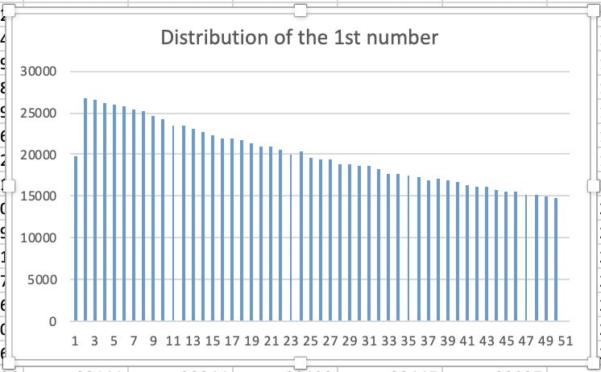
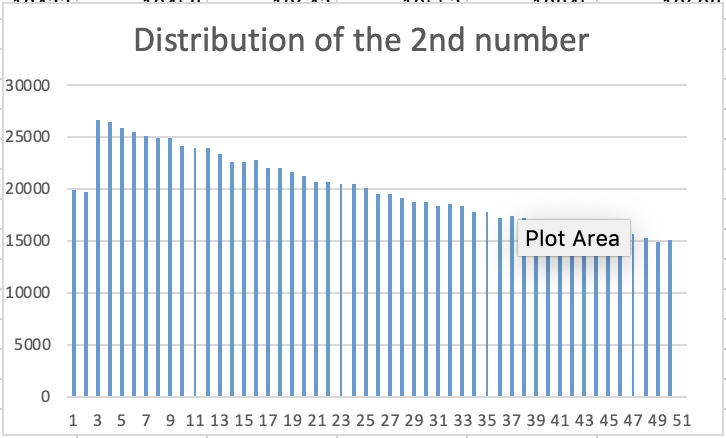
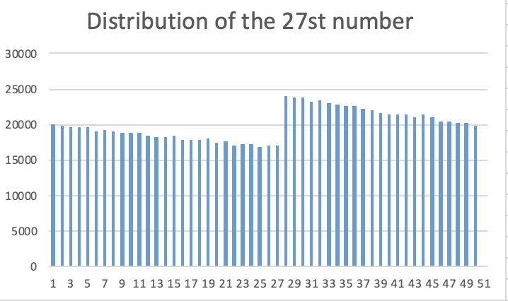
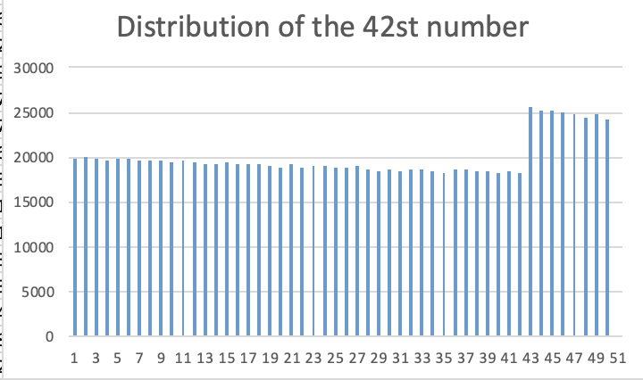

# Distribution of unfair shuffle
## Intro
This is the optional assignment for CPE 593--Show distribution of unfair shuffle.

## Procedures
- The java program calculates the distribution of 50 numbers, after they are being shuffled using "bad shuffle" algorithm. 
- The program runs the shuffle for 1 million times, and record the times a number locating in different positions. 
- Then bar charts are made to show the distribution.

## Result 
If the shuffle is fair, we would see that a number will have equal probability of locating in different positions. But what we see in the charts is, the distribution of a number is not fair, but have some patterns:

For example the 1st number, after bad shuffle, its distribution in different position is:

The 2nd number:

The 27th number:

The 42th number:

